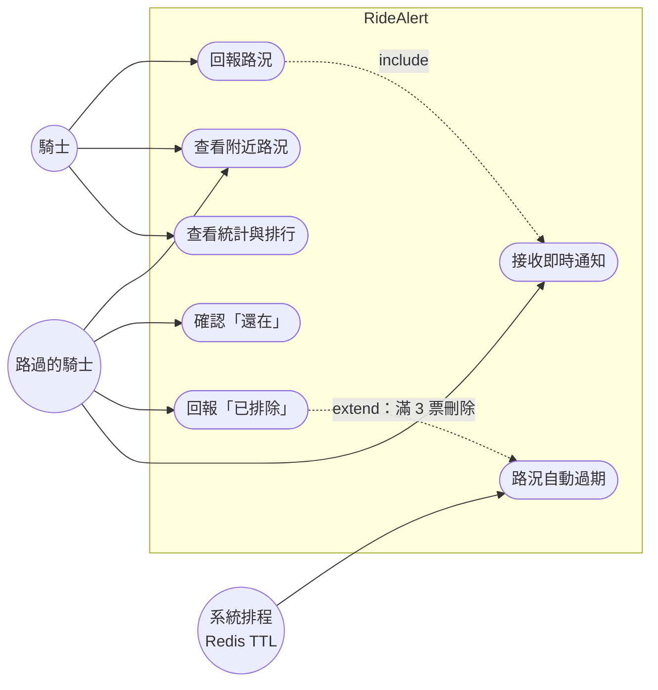
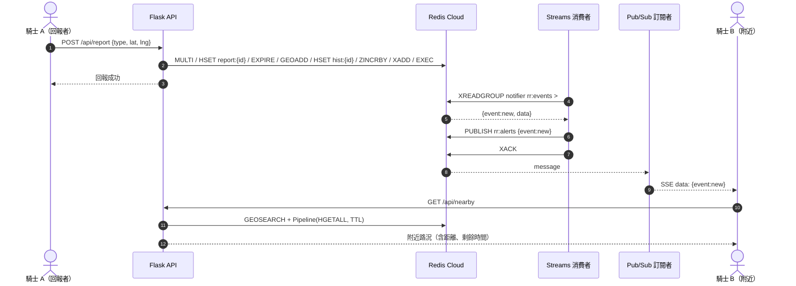
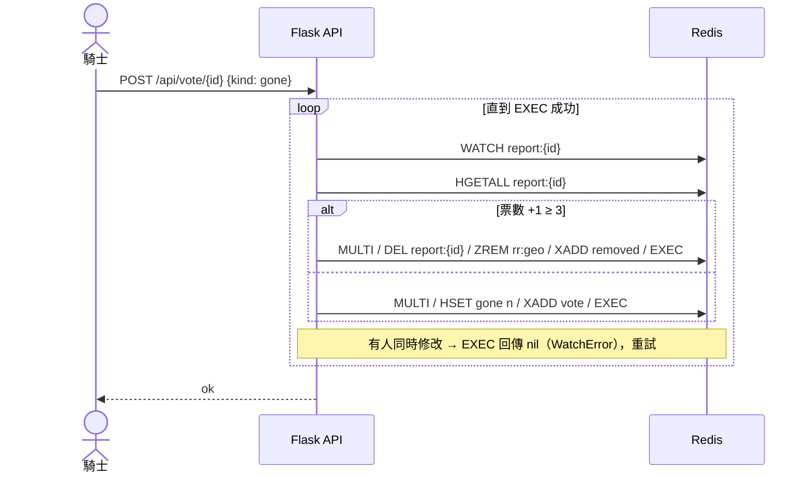
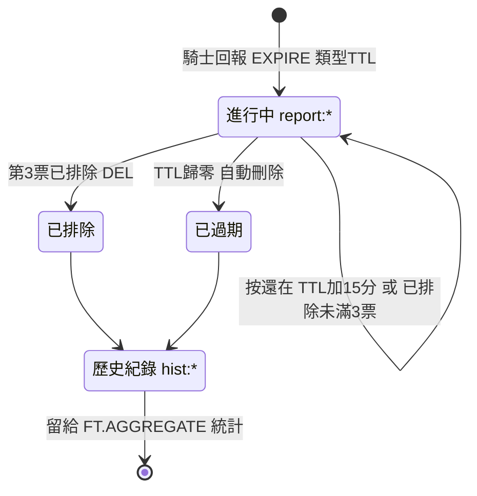
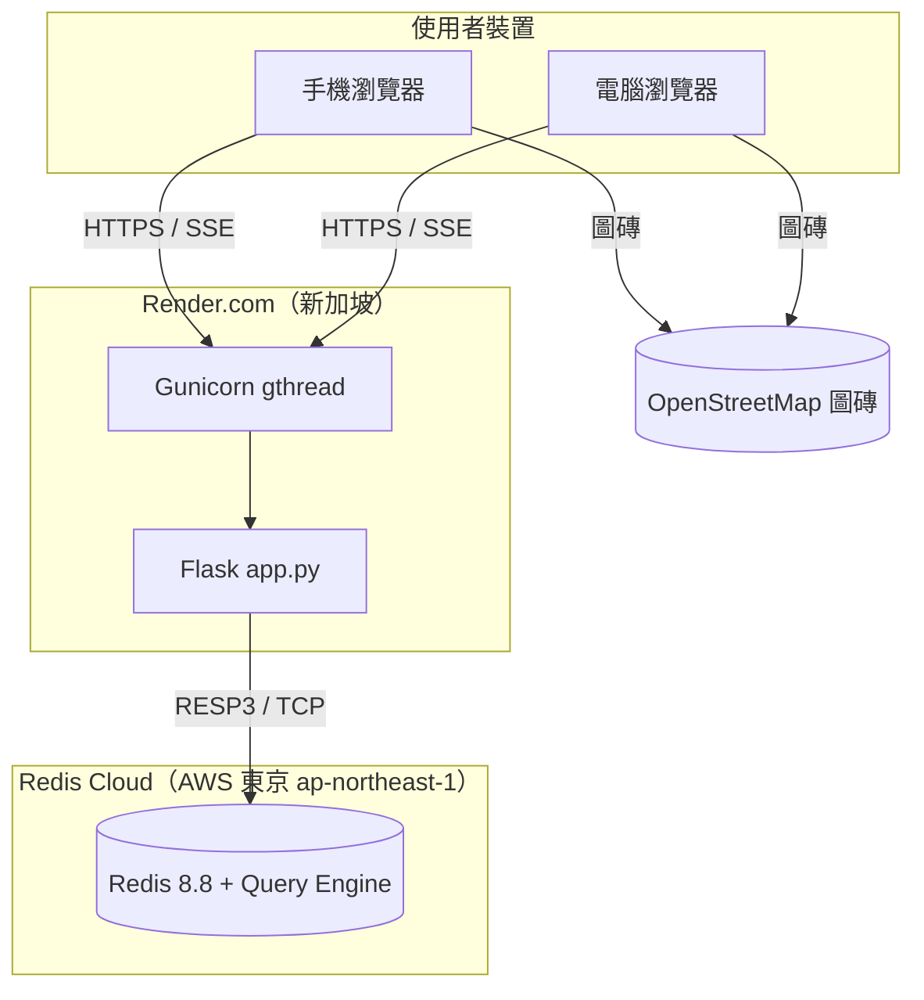

# RideAlert UML 圖

## 1. 用例圖（Use Case）

```mermaid
flowchart LR
  rider((騎士))
  viewer((路過的騎士))
  sys((系統排程<br>Redis TTL))
  subgraph RideAlert
    U1([查看附近路況])
    U2([回報路況])
    U3([確認「還在」])
    U4([回報「已排除」])
    U5([接收即時通知])
    U6([查看統計與排行])
    U7([路況自動過期])
  end
  rider --> U2
  rider --> U1
  rider --> U6
  viewer --> U1
  viewer --> U3
  viewer --> U4
  viewer --> U5
  sys --> U7
  U2 -. include .-> U5
  U4 -. extend：滿 3 票刪除 .-> U7
```

## 2. 循序圖：回報路況 → 附近騎士收到通知

```mermaid
sequenceDiagram
  autonumber
  actor A as 騎士 A（回報者）
  participant API as Flask API
  participant R as Redis Cloud
  participant W as Streams 消費者
  participant F as Pub/Sub 訂閱者
  actor B as 騎士 B（附近）
  A->>API: POST /api/report {type, lat, lng}
  API->>R: MULTI / HSET report:{id} / EXPIRE / GEOADD / HSET hist:{id} / ZINCRBY / XADD / EXEC
  API-->>A: 回報成功
  W->>R: XREADGROUP notifier rr:events >
  R-->>W: {event:new, data}
  W->>R: PUBLISH rr:alerts {event:new}
  W->>R: XACK
  R-->>F: message
  F-->>B: SSE data: {event:new}
  B->>API: GET /api/nearby
  API->>R: GEOSEARCH + Pipeline(HGETALL, TTL)
  API-->>B: 附近路況（含距離、剩餘時間）
```

## 3. 循序圖：投票（樂觀鎖）

```mermaid
sequenceDiagram
  actor B as 騎士
  participant API as Flask API
  participant R as Redis
  B->>API: POST /api/vote/{id} {kind: gone}
  loop 直到 EXEC 成功
    API->>R: WATCH report:{id}
    API->>R: HGETALL report:{id}
    alt 票數 +1 ≥ 3
      API->>R: MULTI / DEL report:{id} / ZREM rr:geo / XADD removed / EXEC
    else
      API->>R: MULTI / HSET gone n / XADD vote / EXEC
    end
    Note over API,R: 有人同時修改 → EXEC 回傳 nil（WatchError），重試
  end
  API-->>B: ok
```

## 4. 狀態圖：一筆路況的生命週期

```mermaid
stateDiagram-v2
  state "進行中 report:*" as A
  state "已排除" as B
  state "已過期" as C
  state "歷史紀錄 hist:*" as D
  [*] --> A: 騎士回報 EXPIRE 類型TTL
  A --> A: 按還在 TTL加15分 或 已排除未滿3票
  A --> B: 第3票已排除 DEL
  A --> C: TTL歸零 自動刪除
  B --> D
  C --> D
  D --> [*]: 留給 FT.AGGREGATE 統計
```

## 5. 部署圖

```mermaid
flowchart TB
  subgraph Client[使用者裝置]
    phone[手機瀏覽器]
    pc[電腦瀏覽器]
  end
  subgraph Render[Render.com（新加坡）]
    gun[Gunicorn gthread]
    app[Flask app.py]
  end
  subgraph RC[Redis Cloud（AWS 東京 ap-northeast-1）]
    db[(Redis 8.8 + Query Engine)]
  end
  osm[(OpenStreetMap 圖磚)]
  phone & pc -- HTTPS / SSE --> gun --> app
  app -- RESP3 / TCP --> db
  phone & pc -- 圖磚 --> osm
```
